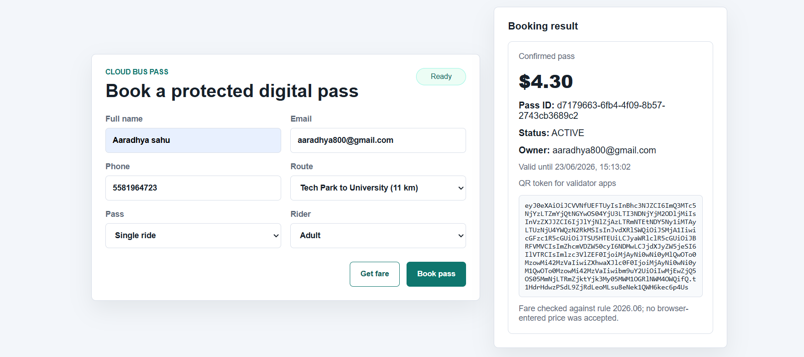
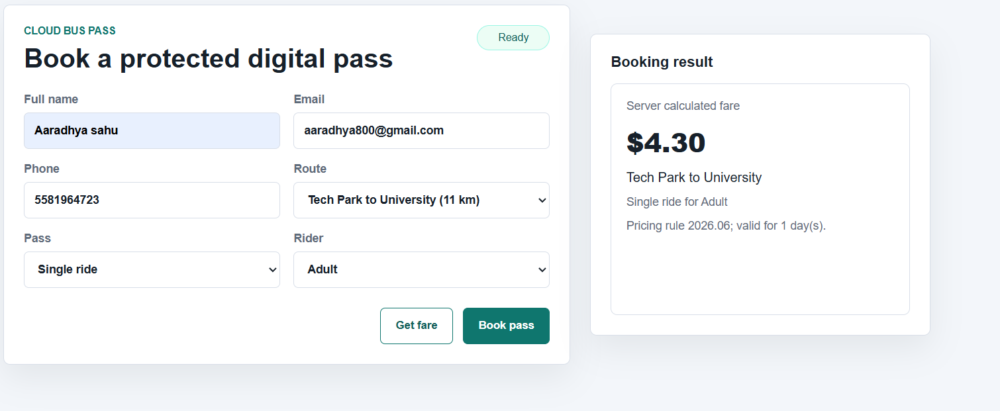

# Cloud-Based Bus Pass System

This project is a complete cloud-based online bus pass booking system designed for scalable deployment. It includes a web UI, REST API, and persistent storage with server-side pricing logic. The system supports secure digital pass generation using signed tokens, along with validation and revocation endpoints. It is containerized using Docker and includes Kubernetes manifests for deployment and autoscaling. The project also includes testing for reliability and performance.
## Covered Requirements

- Online booking: users can request a fare and book a digital bus pass from the browser.
- Prevent ticket loss: every pass is stored in the database and can be retrieved by pass ID plus purchaser email.
- Prevent theft: QR/pass tokens are HMAC-signed, tied to the purchaser and pass record, and checked against database status.
- Prevent incorrect pricing: the API ignores browser-supplied prices and calculates every fare from server-side catalog rules.
- Handle high traffic: Kubernetes deployment includes readiness/liveness probes, resource limits, and a HorizontalPodAutoscaler.
- Improve reliability: idempotency keys prevent duplicate bookings during network retries, and health endpoints support load balancers.

## Run Locally

```bash
node --version
npm test
npm start
```

Open `http://localhost:3000`.

The app uses Node.js built-in SQLite support, so Node 24 or newer is required.
If Windows PowerShell blocks `npm.ps1`, run the same commands directly:

```bash
node --test tests/*.test.js
node src/server.js
```

## API Overview

```http
GET /api/routes
POST /api/quote
POST /api/bookings
GET /api/bookings/:passId
POST /api/passes/validate
POST /api/passes/:passId/revoke
GET /healthz
GET /readyz
```

Example booking request:

```json
{
  "routeId": "R101",
  "passType": "WEEKLY",
  "riderType": "STUDENT",
  "idempotencyKey": "client-generated-unique-key",
  "user": {
    "name": "Aarav Mehta",
    "email": "aarav@example.com",
    "phone": "+1 555 0100"
  }
}
```

## Security and Pricing Design

- The client never decides the fare. `src/pricing.js` calculates fares using route distance, pass type, rider type, and a pricing rule version.
- Pass tokens are signed in `src/token.js`. A changed token fails validation.
- Validation checks both the signature and the database record, so stolen or lost passes can be revoked.
- The booking endpoint uses `idempotencyKey` to safely retry requests without creating duplicate passes.
- Admin revocation requires the `x-admin-key` header.

## Cloud Deployment

Build and run with Docker:

```bash
docker compose up --build
```

Deploy to Kubernetes:

```bash
kubectl apply -f deploy/k8s/secret.example.yaml
kubectl apply -f deploy/k8s/pvc.yaml
kubectl apply -f deploy/k8s/deployment.yaml
kubectl apply -f deploy/k8s/service.yaml
kubectl apply -f deploy/k8s/hpa.yaml
```

For production, replace SQLite/PVC with a managed database such as PostgreSQL or Cloud SQL so multiple pods can write concurrently across nodes. The current repository layer is intentionally small, so swapping the storage implementation is straightforward.

## Test Coverage

The tests verify:

- fare calculation and invalid catalog rejection;
- server-side price protection against client tampering;
- idempotent booking retries;
- signed-token validation;
- revoked pass rejection.
  
  ## Project Preview
  ## Image 1
    

  ## Image 2
    
  